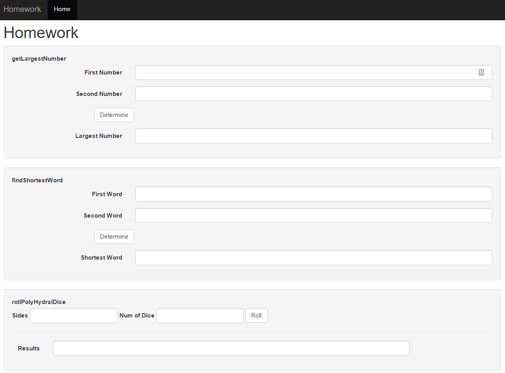

# Homework #4

Create a new Project and Repository

Turn in via Github link

#### PROJECT
1. Create a webpage styled using Bootstrap.css
   * **OPTIONAL**, apply your own style
2. Implement a way for users to interact with the following JavaScript functions
   * getLargestNumber - This method takes 2 parameters and returns the larges number
   * findShortestWord - This method takes 2 parameters and returns the shortest word
   * rollPolyHydralDice - This method takes 2 parameters the number of sides the dice have and the number of dice to roll. It must return an array of the random numbers generated.

#### REPOSITORY
1. A Readme file containing the homework assignment
2. A License file using the MIT template
3. A folder containing all files needed to complete the assignment

#### Interface Design

